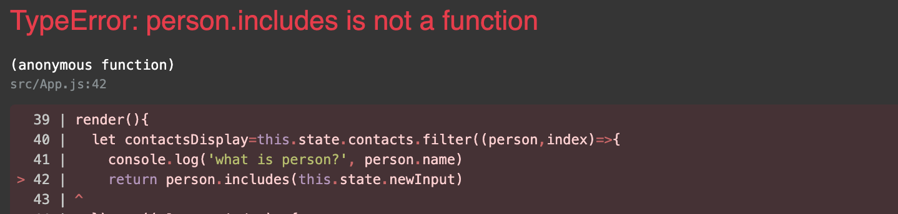

Make sure the data type of the element you're trying to use the method off of is the correct data type for it.

ex. Object.includes is not a function, but Array.includes or String.includes is a function.